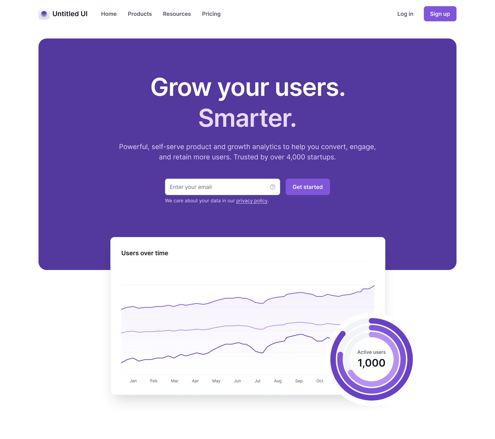
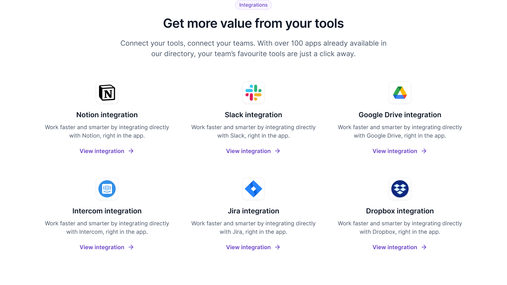
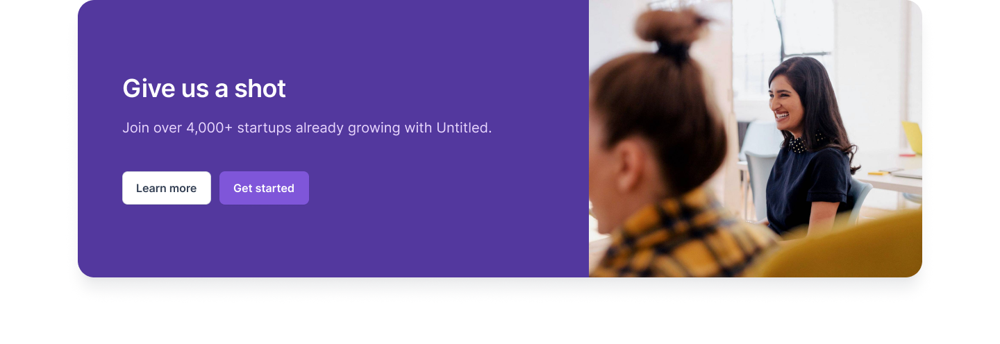
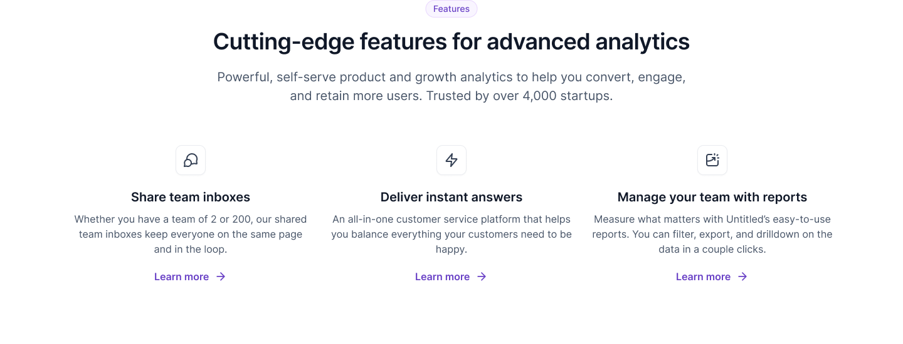
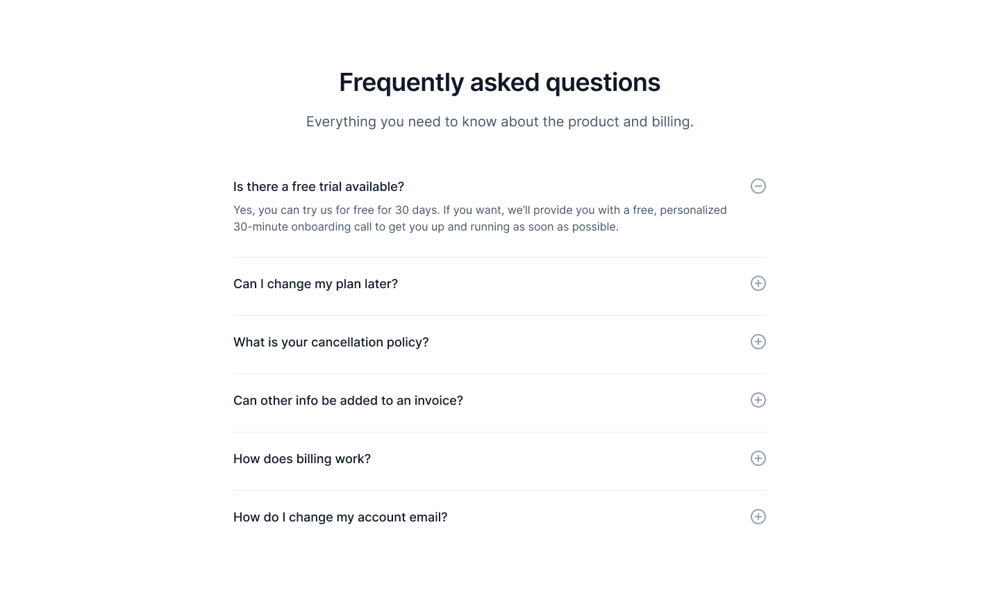
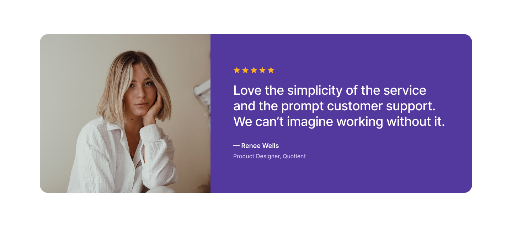
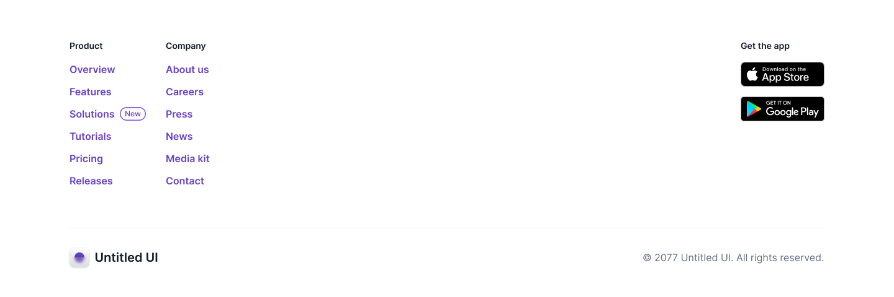

# Untitled UI

Landing page created based on shared design through Figma.

## Table of Contents

- [Features](#features)
- [Screenshots](#screenshots)
- [Installation and Execution](#installation)

## Features

- Responsive Design.
- Reusable components.
- Deployed in Vercel .

## Screenshots










## Installation and Execution

For this project, Next.js V14.1.0 was used, and it was developed with TypeScript, Tailwind CSS to handle types correctly.


```bash
# Install dependencies
npm install

# Run 
npm run dev

